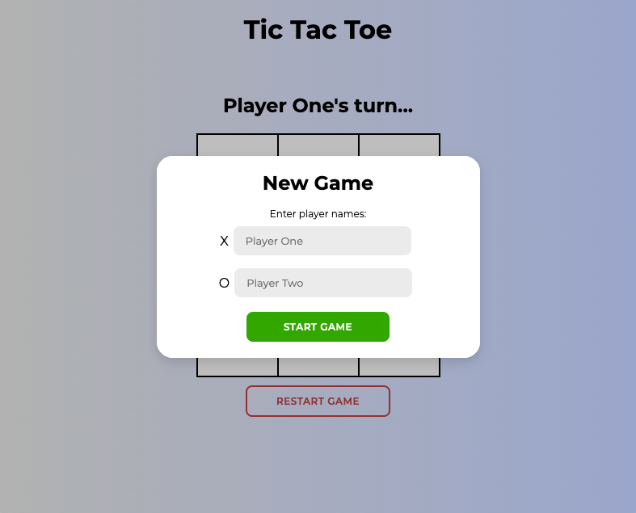

# tic-tac-toe
Tic Tac Toe game you can play in your browser. Practice use of factory functions and the module pattern.

Using factory functions in the game.js file to store the board inside a Gameboard object, the game inside a GameController object and functions that interact with the display/DOM inside the ScreenController object.

You can enter names for each player or just leave it as is and the names will default to player one and player two.

The game can be restarted at any point during the game.

[Live demo](https://golfsap.github.io/tic-tac-toe/)

## Screenshot

